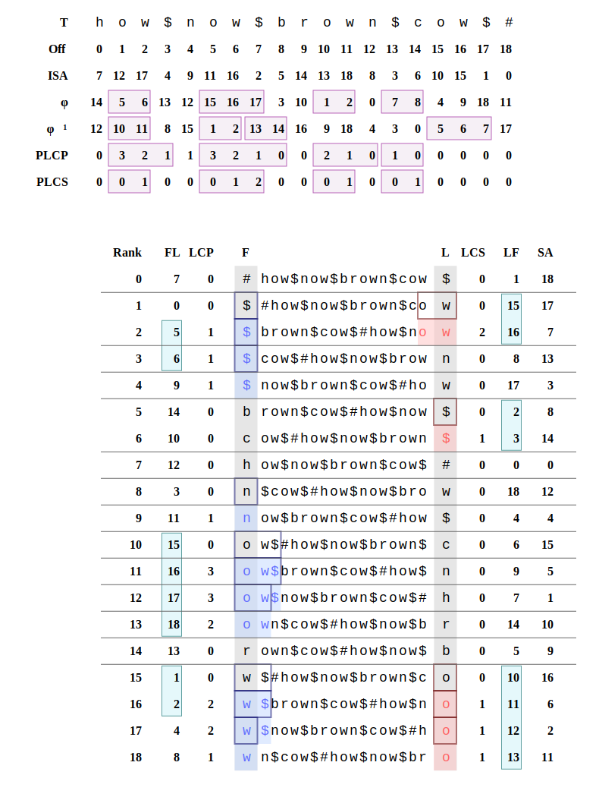

# BWT-SVG: Burrows-Wheeler Transform Visualization

[](https://github.com/langmead/bwt-svg)

This project provides functionality for building the Burrows-Wheeler Transform (BWT) and various other arrays and functions that are useful both in text space (φ, φ⁻¹, ISA, PLCP, etc) and in lex space (SA, LF, LCP, LCS, etc).

The main program accepts an input string and produces a rendered SVG image of the Burrows Wheeler matrix of the string along with several associated structures.  For example:



That was made using:

```
python -m bwt_svg render 'how$now$brown$cow$#' --background-color '#ffffff'
```

The pictured structures include:

- **Suffix Array (SA)**: Array of starting positions of sorted suffixes
- **Inverse Suffix Array (ISA)**: Inverse mapping of SA
- **Burrows-Wheeler Transform (BWT)**: Last column of the Burrows-Wheeler matrix
- **Longest Common Prefix (LCP)**: Array of longest common prefixes between adjacent suffixes
- **Longest Common Suffix (LCS)**: Array of longest common suffixes between adjacent rotations
- **Last-First mapping (LF)**: Mapping from BWT position to SA position
- **First-Last mapping (FL)**: Mapping from SA position to BWT position (also called Psi, Ψ)
- **Phi (φ)**: Text-space predecessor function
- **Inverse Phi (φ⁻¹)**: Text-space successor function
- **Permuted LCP (PLCP)**: Longest common prefix (LCP) array permuted to text order
- **Permuted LCS (PLCS)**: Longest common suffix (LCS) array permuted to text order

The common prefixes and suffixes that give the LCPs and LCSs are highlighted with red and blue rectangles respectively in the Burrows-Wheeler matrix.

Compressible stretches of the numeric arrays (e.g. maximal stretches of length 2 or greater where the value repeatedly increases by 1 or decreases by 1) are also highlighted.  This is an easy way to visualize and study the ways in which the BWT enables compressed indexes like r-index and the move structure.

The code is also capable of outputting thresholds (`--show-thresholds`) and maximal unique matches (MUMs, via `--show-mums`).

## Web Interface

Try the [interactive web interface](https://benlangmead.github.io/bwt-svg/); no installation required!  Hosted by GitHub pages and implemented using [Pyodine](https://pyodide.org).

## Usage

### Installation
```bash
# Install from source
pip install .

# Or run directly without installation
python3 -m bwt_svg
```

### Render Mode (SVG Output)
```bash
# Using the package
python3 -m bwt_svg render 'GATTACA$' --show-thresholds
python3 -m bwt_svg render 'how$now$brown$cow$#' --show-mums

# Or if installed via pip
bwt-svg render 'GATTACA$' --show-thresholds
```

### Print Mode (Text Output)
```bash
# Using the package
python3 -m bwt_svg print 'GATTACA$' --show-thresholds

# Or if installed via pip
bwt-svg print 'GATTACA$' --show-thresholds
```

**Notes**
- The use of single quotes is important, otherwise the shell will try to interpret the dollar signs.
- If your input consists of several strings concatenated, I suggest you end each of the individual strings with a dollar-sign symbol (`$`) then end the overall string with a hash symbol (`#`), as I did in the `how$now$brown$cow$#` example above.

### Output

**Render mode** outputs an SVG image file to `bwt_diagram.svg`. This is a vector graphics file that can be loaded into Inkscape, Adobe Illustrator, Affinity Designer, or similar. If you load the SVG file into those programs, you will notice that the graphics are bundled into a hierarchy of SVG "groups" ("layers" in the editing programs), allowing for some parts of the diagram to be selectively hidden/shown.

**Print mode** simply prints the relevant arrays and matrices to stdout.

## Features

- **Visual highlighting**: Common prefixes (LCP) are highlighted in blue, common suffixes (LCS) in red
- **Visualization of compressible portions**: Automatically highlights compressible stretches in numeric arrays like LF, FL, φ (Phi), and φ⁻¹ (Phi inverse)
- **Threshold visualization**: Shows each of the character-specific LCP threshold arrays when you specify `--show-thresholds`
- **MUM detection**: Identifies and highlights Maximal Unique Matches between sequences when you specify `--show-mums`
- **Layered SVG output**: Organized into groups/layers for selective viewing and hiding in graphics editors like Illustrator, Designer or Inkscape

## Implementation

No attempt is made to make the data structure building methods in `bwt.py` efficient! This code is designed to be simple, with the expectation that it will be used only for examples that are small enough to be displayed.

## Requirements

- Python 3.x
- No external dependencies (uses only standard library)
- Test using pytest

## Author

Ben Langmead  
Date: 10/7/2025

## License

MIT License - see LICENSE file for details.
